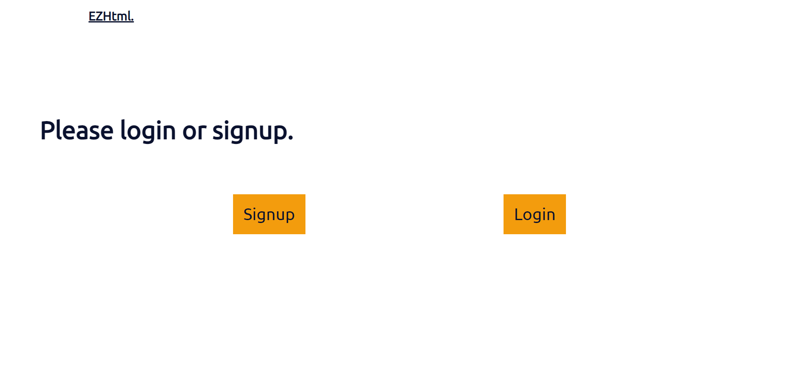
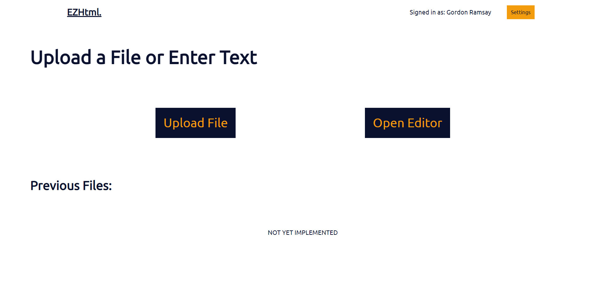
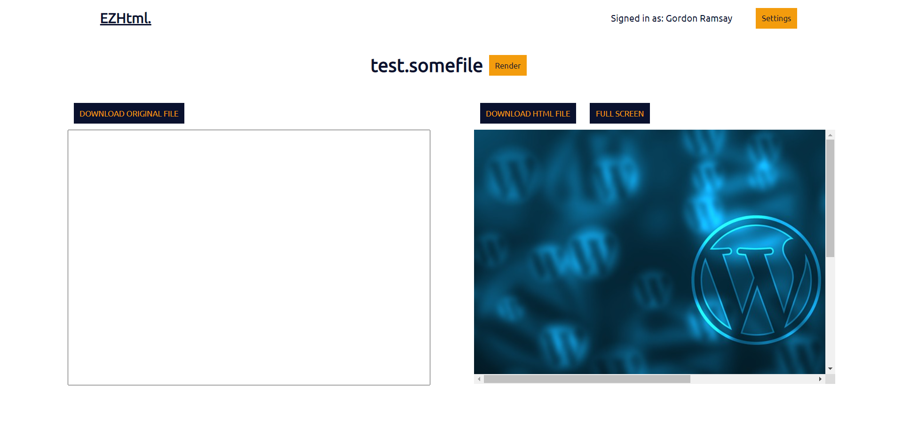
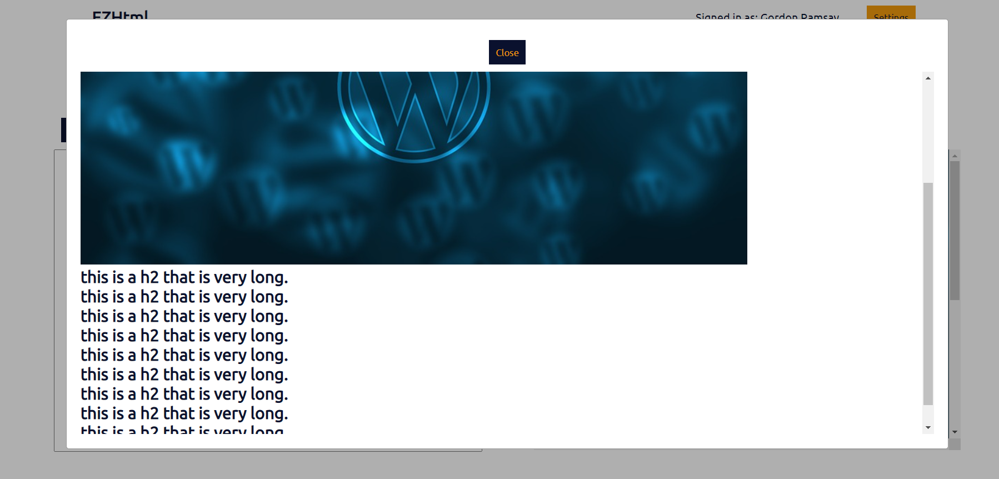
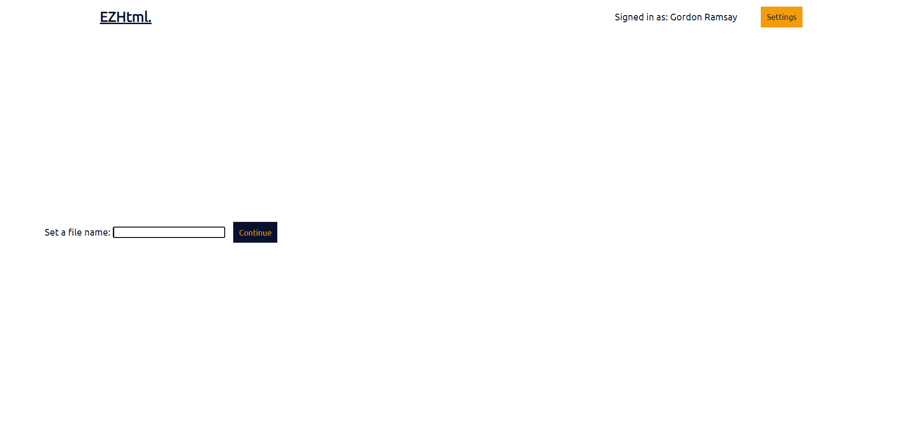
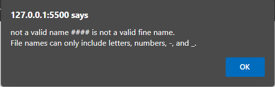
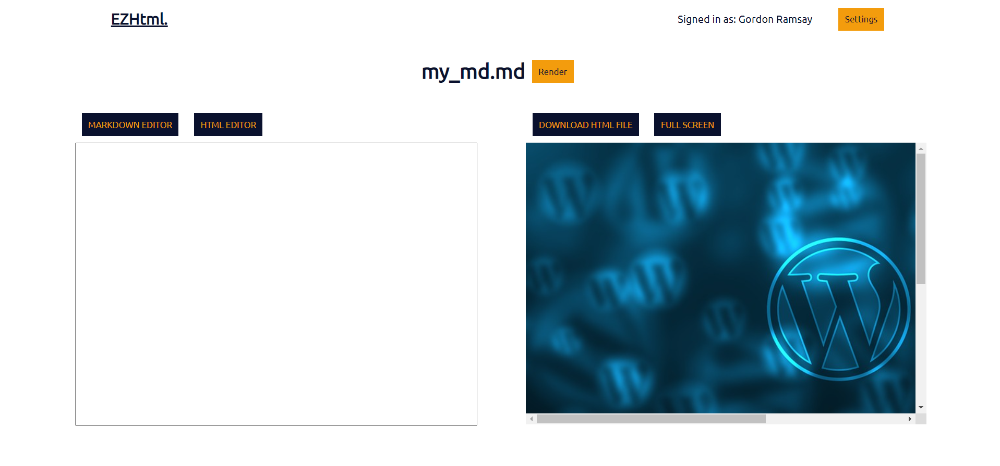
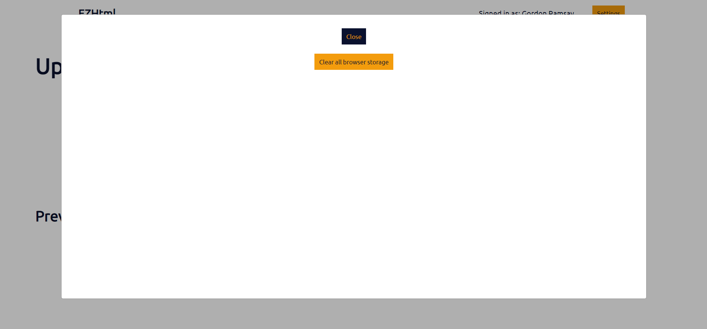
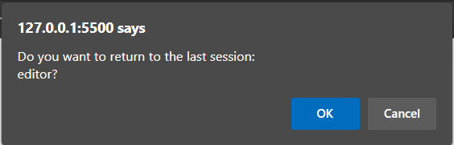

# Maxpilot -- EzHTML

## Part 1 -- Data Interactions

- The user upload a file in the fromat .md, .txt, .png (and other image files), or .docx, though other file types could be supported down the road. The server then recieves the request and parses the files into HTML using the appropriate tags.

    - For example, the following markdown:
        ```md
        # Hello World 

        - This is a bullet point.

        *And this is in italics.*
        ```

        Translates to:

        ```html
        <h1>Hello World</h1>
        <br/>
        <ul>
            <li>This is a bullet point</li>
        </ul>
        <br/>
        <i>And this is in italics.</i>
        ```

- The user may also enter the markdown themselves and see the rendered result.

- After the user recieves the parsed HTML, they can edit it in a editor and see the rendered result in real time within the site.

- Finaly, the user may choose to download, remove, or edit files on the server.

## Part 2 -- HTML and CSS

- Note: All HTML is dynamically inserted into `index.html` by `main.js`.

### Login Screen:


- This is a screen shown to a user who is not authenticated, or who has not visited the site recently.
- The user can then choose to login or signup, which is not yet implemented.

### Landing Page:


- This is what the user sees if they are authenticated.
- They can choose to edit their user settings, upload a new file to be parsed, or open a markdown editor to write their own markdown right in the application and parse it.
- Past files will be shown at the bottom, if they exist. The user may then open these files to view/edit the html.

### Uploaded File Editor



- This is the screen the user sees after they have uploaded a file. The parsed HTML will be shown on the left, and the user may edit it and display it on the right side by using the render button.

- The user also has the option to download the original file, or the parsed HTML file from the server.

- The user can click on FULLSCREEN, and this shows the fullscreen render of the html. For example:

    - 

### Markdown Editor

- The user is first promperd to enter a file name:

    - 

        - If the file name is invalid the user will recieve a error message:

            - 
- If the name is valid they are sent to the editor screen.



- Here the user can edit and view the parsed markdown. They can also change the resulting html. This editor is similar to the Upload File editor, and the rest of the functionality is the same.

### Settings



- In the settings menu the user will be able to change their user profile, and clear their localStorage, which is the only functionality currently implemented.

### Remembering the last open session



- The user will be prompted to go back to their most recent session if they come back to the site and are still authenticated. This helps the user as it prevents data loss if they accedentally exit the tab.

## Part 3 -- JavaScript

- [Click here for the video.](https://umass-my.sharepoint.com/:v:/g/personal/mkuechen_umass_edu/ETl1X6yMM8hCpefgyHigZ2oB1dLpA6dphz414eCxrT8UgQ?e=4b2Ybz)

- `index.html` is the HTML file initially served to the browser.

- `main.css` includes all styling for the site.

- `main.js` renderes the nessisary UI, and calls nessisary helper.

- `user.js` handles authentication and stores information about the user.

- ` editor.js` includes helpers for the markdown editor.

- `uploadRenderer.js` includes helpers for the upload editor.

## Part 4 -- Commits and Tagged Release

- There are more than 5 commits.

- [Github Repo](https://github.com/MAXPIL0T/cs326-project-maxpilot)